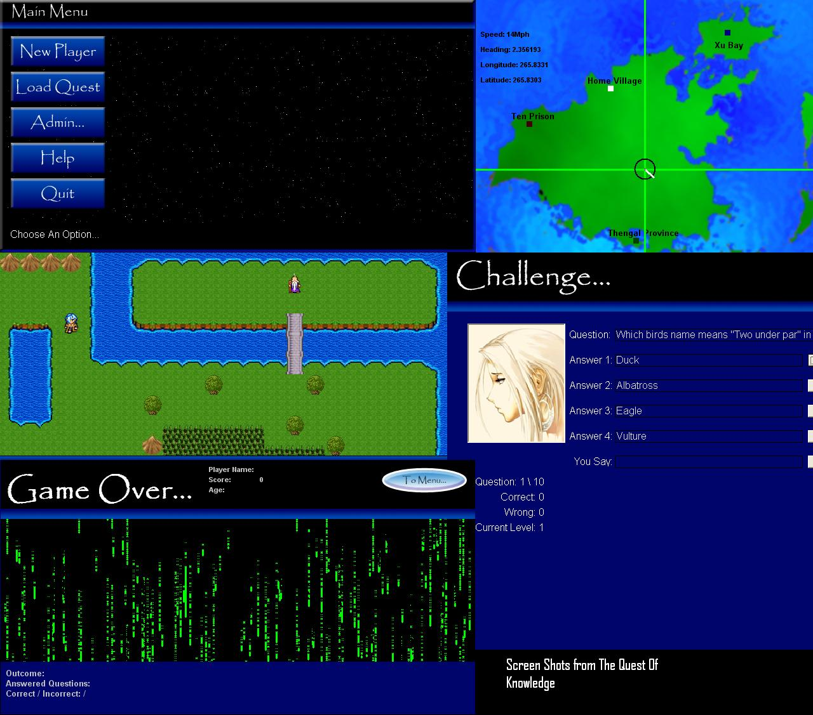



## Quest of Knowledge \(massive project\)

### Description

uses loads of coding to achieve lots of different objectives without using a single control (apart from default obviously) also features a log in feature to edit scores, default password is 'lothlorien' you can change this, it also shows how to save this password to a file securely by passing the password through an algorithm to encrypt and de-crypt it, nothing special though.
 
### More Info
 
inputs, this game features an rpg map engine, an interactive quiz that takes questions from an access database, a very user controled wrld map which includes a brilliantly simple but affective physics engine (some maths involved)

read things in game, not finished! only two location have quizes and game over functionality, this is explained in game.

returns results from quizes, ombat (yes there is a basic combat engine in there too!)

BIG any loads of files

             |
---                |---
**Submitted On**   |2004-06-28 19:54:16
**By**             |[Jordon Pilling](https://github.com/Planet-Source-Code/PSCIndex/blob/master/ByAuthor/jordon-pilling.md)
**Level**          |Advanced
**User Rating**    |3.7 (26 globes from 7 users)
**Compatibility**  |VB 6\.0
**Category**       |[Graphics](https://github.com/Planet-Source-Code/PSCIndex/blob/master/ByCategory/graphics__1-46.md)
**World**          |[Visual Basic](https://github.com/Planet-Source-Code/PSCIndex/blob/master/ByWorld/visual-basic.md)
**Archive File**   |[Quest\_of\_K1823971212004\.zip](https://github.com/Planet-Source-Code/jordon-pilling-quest-of-knowledge-massive-project__1-57498/archive/master.zip)

### API Declarations

crap loads lol

